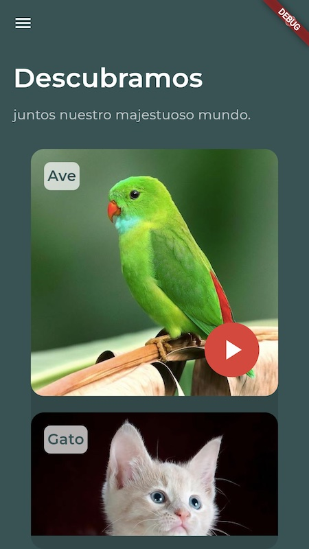
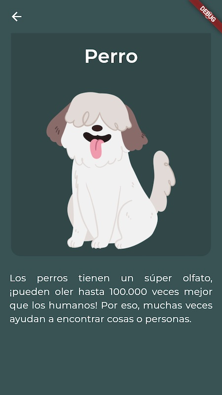

# Appnimal 


🐦🐱🐄🐶🐴🦁🐔

**Appnimal** es una aplicación móvil desarrollada en Flutter para ofrecer una experiencia informativa y entretenida sobre animales. La aplicación permite a los usuarios explorar una variedad de animales, ver detalles específicos de cada uno y escuchar sus sonidos. La arquitectura de la aplicación se basa en una estructura modular y bien organizada, facilitando la mantenibilidad y escalabilidad del proyecto.

## Características Principales

- **Pantalla Principal (Appnimal Screen)**: Presenta una lista de animales con imágenes y permite navegar a la pantalla de detalles.
- **Pantalla de Detalles (Detalle Screen)**: Muestra información detallada sobre el animal seleccionado, incluyendo una imagen ampliada y una descripción.
- **Reproducción de Sonidos**: Permite escuchar los sonidos de los animales directamente desde la aplicación.
- **Transiciones Animadas**: Incluye transiciones animadas suaves al navegar entre pantallas para una mejor experiencia de usuario.
- **Diseño Responsivo**: Adaptado para funcionar en diferentes tamaños de pantalla, asegurando una buena visualización en dispositivos móviles y tabletas.


## Estructura del Proyecto

```plaintext
appnimal/
├── constants/
│   ├── color.dart
├── data/
│   ├── items.json
├── models/
│   ├── item_model.dart
├── screens/
│   ├── appnimal_screen.dart
│   ├── detalle_screen.dart
├── utils/
│   ├── load_items.dart
│   ├── routes.dart
├── widgets/
│   ├── audio_player_widget.dart
│   ├── boton_reproduccion_widget.dart
│   ├── contenedor_decorativo_widget.dart
│   ├── detalle_descripcion_widget.dart
│   ├── detalle_imagen_widget.dart
│   ├── encabezado_widget.dart
│   ├── item_widget.dart
```


## Tecnologías Utilizadas
- **Flutter**: Framework principal utilizado para el desarrollo de la aplicación.

- **Dart**: Lenguaje de programación utilizado en Flutter.

- **JSON**: Formato de datos utilizado para almacenar y cargar información estática.

- **just_audio**: ^0.9.42: Biblioteca utilizada para la reproducción de audio en la aplicación.

## Capturas de pantalla

| Principal | Detalle |
|-----------|-----------|
|  |  |


## Instalación y Uso

1. Clona este repositorio en tu máquina local:
   ```sh
   git clone https://github.com/tu_usuario/appnimal.git
    ```

2. Navega al directorio del proyecto::
   ```sh
   cd appnimal
    ```
3. Instala las dependencias:
   ```sh
   flutter pub get
    ```
4. Ejecuta la aplicación:
   ```sh
    flutter run -d chrome  
    ```